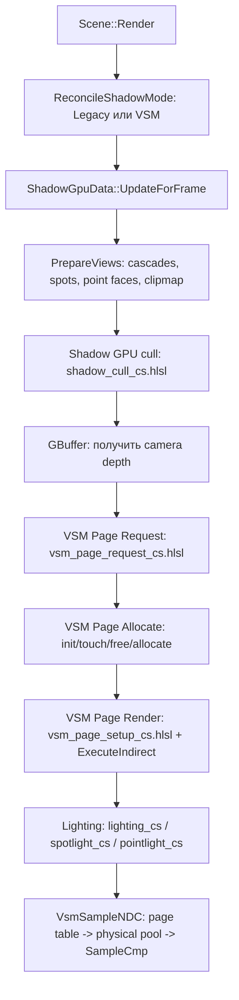
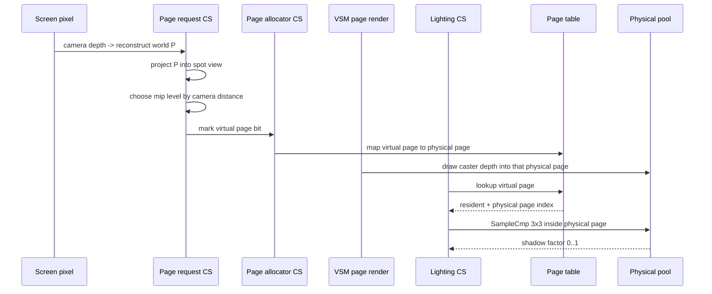

# Virtual Shadow Maps в этом проекте: лекция для начинающих

Цель этого документа - объяснить VSM так, чтобы стало понятно, что именно происходит в
рендерере `test_cube`: какие данные создаются, какие compute/graphics passes идут по кадру,
как пиксель на экране превращается в запрос страницы, как страница получает физическое место
в пуле, как туда рендерятся caster'ы, и как lighting потом сэмплит тень.

Важно: в этом проекте `VSM` означает **Virtual Shadow Maps**, а не Variance Shadow Maps.
То есть это не алгоритм с моментами/variance, а система виртуализации теневых карт:
виртуальные страницы -> page table -> физический depth pool.

---

## 1. Зачем вообще нужны shadow maps

Обычная shadow map работает так:

1. Сначала сцену рисуют **из позиции источника света** в depth texture.
2. Потом при освещении обычного пикселя берут world position этого пикселя.
3. Проецируют эту точку в пространство света.
4. Сравнивают глубину точки с глубиной, записанной в shadow map.
5. Если в shadow map ближе к свету уже есть другой объект, текущая точка в тени.

Мини-схема:

```text
        light
          *
         /|
        / |     depth from light sees cube first
       /  |
   cube   | receiver pixel
    []    v
----------x---------- ground

Если свет "смотрит" вдоль луча и раньше receiver видит cube,
receiver считается затененным.
```

В legacy path этого проекта есть классические shadow atlases:

- directional light: CSM cascade atlas;
- spot lights: array atlas;
- point lights: cube/cube-array atlas.

VSM заменяет локальные spot/point atlas'ы и добавляет directional clipmap path, но делает это
не как один фиксированный atlas на каждый свет, а как систему страниц.

---

## 2. Главная идея VSM

Обычная shadow map говорит:

> "Вот тебе целая texture 512x512 или 2048x2048. Рендери ее целиком, даже если на экране
> нужна только маленькая часть".

VSM говорит:

> "Представим, что у каждого света есть большая виртуальная shadow map. Но реально выделим
> память только под те маленькие страницы, которые нужны видимым пикселям текущего кадра".

В этом проекте виртуальная карта разбита на страницы `128x128` texels:

```cpp
// sources/rendering/renderables/VirtualShadowMap.h
inline constexpr std::uint32_t kPageSize = 128;
inline constexpr std::uint32_t kVirtualRes = 2048;
inline constexpr std::uint32_t kVirtualPagesL0Axis = kVirtualRes / kPageSize; // 16
```

Одна finest-level virtual shadow map выглядит так:

```text
Virtual shadow map 2048x2048

16 pages по X, 16 pages по Y, каждая page = 128x128 texels

+----+----+----+----+     +----+
|0,0 |1,0 |2,0 |... | ... |15,0|
+----+----+----+----+     +----+
|0,1 |1,1 |2,1 |... | ... |15,1|
+----+----+----+----+     +----+
| ...                         ... |
+----+----+----+----+     +----+
|0,15|1,15|2,15|... | ... |15,15|
+----+----+----+----+     +----+
```

Но физически все страницы всех VSM views живут в одном общем пуле:

```cpp
// sources/rendering/renderables/VirtualShadowMap.h
inline constexpr std::uint32_t kPoolTexels = 4096;
inline constexpr std::uint32_t kPoolPagesPerAxis = kPoolTexels / kPageSize; // 32
inline constexpr std::uint32_t kPoolPageCount = kPoolPagesPerAxis * kPoolPagesPerAxis; // 1024
```

Физический pool:

```text
VSM physical page pool: 4096x4096 D16

32 x 32 physical pages = 1024 pages total
each page = 128x128 depth texels

+----+----+----+----+-----+
| p0 | p1 | p2 | p3 | ... |
+----+----+----+----+-----+
| p32| p33| p34| ...      |
+----+----+----+----------+
| ...                     |
+-------------------------+
```

То есть VSM - это как virtual memory:

```text
Virtual page id                  Page table                    Physical pool page
(view, mip, px, py)     ->       resident + phys index    ->   128x128 depth cell
```

---

## 3. Какие VSM views существуют

VSM не хранит "одну карту на всю сцену". У каждого shadow-view свой набор виртуальных страниц.

В проекте layout такой:

```cpp
// sources/rendering/renderables/VirtualShadowMap.h
inline constexpr std::uint32_t kNumLocalVirtualViews = 32; // 8 spots + 4 point lights * 6 faces
inline constexpr std::uint32_t kNumClipmapLevels = 8;
inline constexpr std::uint32_t kMaxVirtualViews = kNumLocalVirtualViews + kNumClipmapLevels; // 40
```

Расклад:

```text
VSM view slots:

0..7     spot light shadow slots
8..31    point light cube faces: 4 point lights * 6 faces
32..39   directional clipmap levels
```

В legacy path у renderer'а есть еще 4 CSM cascades. Поэтому GPU cull layout шире:

```cpp
// sources/rendering/core/RenderConstants.h
inline constexpr unsigned kMaxShadowViews = 44;
// 4 cascade + 8 spot + 4*6 point + 8 clipmap
```

Смысл:

- legacy directional CSM занимает первые 4 view slots в shadow cull;
- VSM local views идут после cascades;
- VSM clipmap views добавлены в конец.

---

## 4. Page table: как виртуальная страница находит физическую

В page table лежит один `uint` на каждую виртуальную страницу:

```cpp
// sources/rendering/renderables/VirtualShadowMap.h
inline constexpr std::uint32_t kPageTableEntries = kPagesPerView * kMaxVirtualViews;
inline constexpr std::uint32_t kPageResidentBit = 0x80000000u;
inline constexpr std::uint32_t kPagePhysicalMask = 0x0000FFFFu;
```

Entry packing:

```text
uint pageTableEntry

bit 31      resident flag
bits 0..15  physical page index

0x8000002A means:
resident = true
phys page = 42
```

HLSL side делает то же самое:

```hlsl
// shaders/vsm_sample.hlsli
static const uint VSM_SAMPLE_RESIDENT_BIT = 0x80000000u;
static const uint VSM_SAMPLE_PHYS_MASK    = 0x0000FFFFu;
```

Функция адресации:

```hlsl
// shaders/vsm_addressing.hlsli
uint VsmPageId(uint view, uint level, uint px, uint py)
{
    uint axis = VSM_L0_AXIS >> level;
    return view * VSM_PAGES_PER_VIEW + VSM_LEVEL_OFFSET[level] + py * axis + px;
}
```

Это формула:

```text
page id = view offset + mip-level offset + page row/column
```

Например:

```text
view = 3
level = 0
px = 5
py = 2

pageId = 3 * 341 + 0 + 2 * 16 + 5
       = 1023 + 37
       = 1060
```

Page table entry `PageTable[1060]` либо говорит "страницы нет", либо "она лежит в physical page N".

---

## 5. Почему есть mip levels

Если всегда запрашивать finest pages `2048x2048`, пул быстро переполнится. Поэтому VSM выбирает
уровень детализации по расстоянию до камеры:

```cpp
// sources/rendering/renderables/VirtualShadowMap.h
inline constexpr std::uint32_t kNumMipLevels = 5; // 16,8,4,2,1 pages per axis
inline constexpr float kLodRefDist = 5.0f;
```

Уровни:

```text
level 0: 16 x 16 pages = 256 pages, virtual res 2048
level 1:  8 x  8 pages =  64 pages, virtual res 1024-ish coverage
level 2:  4 x  4 pages =  16 pages
level 3:  2 x  2 pages =   4 pages
level 4:  1 x  1 page  =   1 page

total per view = 256 + 64 + 16 + 4 + 1 = 341 pages
```

Выбор level:

```hlsl
// shaders/vsm_addressing.hlsli
uint VsmSelectLevel(float distCam, float refDist, uint maxLevel)
{
    int raw = (int)floor(log2(max(distCam, 1e-3f) / max(refDist, 1e-3f)));
    return (uint)clamp(raw, 0, (int)maxLevel);
}
```

Интуитивно:

- рядом с камерой нужна резкая тень -> level 0;
- далеко от камеры экранный пиксель покрывает больше world-space -> можно брать грубее;
- каждая дистанционная "ступень в 2 раза" уводит на следующий mip.

Пример при `refDist = 5`:

```text
dist  3 m  -> log2(3/5) < 0 -> level 0
dist  8 m  -> log2(8/5) ~= 0 -> level 0
dist 12 m  -> log2(12/5) ~= 1 -> level 1
dist 25 m  -> log2(25/5) = 2  -> level 2
dist 80 m  -> log2(80/5) = 4  -> level 4
```

---

## 6. Полный кадр VSM: общая схема

Ниже pipeline именно этого проекта.



Короткая версия:

1. Собрать shadow views.
2. GPU-cull считает, какие caster'ы видимы в каждом shadow-view.
3. GBuffer дает depth видимых экранных пикселей.
4. Page request pass решает: "какие shadow pages нужны этим экранным пикселям?"
5. Allocator дает этим virtual pages физические pages.
6. Page render pass рисует depth caster'ов в physical pool.
7. Lighting pass использует page table и pool, чтобы получить shadow factor.

---

## 7. Включение и lifecycle

VSM включается через `Ctrl+V`:

```cpp
// sources/app/AppController.cpp
if (input.WasActionPressed("ToggleVsmPageRequest"))
{
    render::g_shadowMode = render::VsmActive() ? render::ShadowMode::Legacy
                                               : render::ShadowMode::VSM;
}
```

В начале кадра сцена приводит ресурсы в соответствие с выбранным режимом:

```cpp
// sources/app/scene/Scene.cpp
const bool wantVsm = render::VsmActive();
const bool vsmOk = (wantVsm == vsm_.IsAllocated());
if (!vsmOk) {
    if (wantVsm) { vsm_.EnsureResources(renderer); }
    else { vsm_.ReleaseResources(); }
}
```

Когда VSM активен, spot/point legacy atlases сжимаются до `1x1` placeholders:

```cpp
// sources/rendering/core/RenderTargetManager.cpp
CreateSpotShadowResource(dev, tracker, f, full ? D.spotShadowRes : 1u);
CreatePointShadowResource(dev, tracker, f, full ? D.pointShadowRes : 1u);
```

А сами spot/point shadow passes пропускаются:

```cpp
// sources/app/scene/SceneRenderer.cpp
if (render::VsmActive())
{
    return;
}
```

Это значит:

- Legacy mode: обычные CSM/spot/point atlases.
- VSM mode: local shadows и directional clipmap берутся из VSM pool.
- CSM atlas пока еще полностью не удален из VSM mode: в коде отмечено, что его retirement deferred.

---

## 8. Ресурсы VSM

Главный owner: `VirtualShadowMap`.

Создание physical pool:

```cpp
// sources/rendering/renderables/VirtualShadowMap.cpp
rd.Width = vsm::kPoolTexels;
rd.Height = vsm::kPoolTexels;
rd.Format = DXGI_FORMAT_R16_TYPELESS;
rd.Flags = D3D12_RESOURCE_FLAG_ALLOW_DEPTH_STENCIL;
```

Формат:

- resource: `R16_TYPELESS`;
- DSV: `D16_UNORM`;
- SRV: `R16_UNORM`.

Почему так:

- при render pass это depth texture;
- при lighting pass она читается как texture для comparison sampling.

Создание page table:

```cpp
// sources/rendering/renderables/VirtualShadowMap.cpp
bd.Width = static_cast<UINT64>(vsm::kPageTableEntries) * sizeof(std::uint32_t);
bd.Flags = D3D12_RESOURCE_FLAG_ALLOW_UNORDERED_ACCESS;
```

Еще есть:

- `requestBuffer_`: bitfield запросов, 1 bit на virtual page;
- `physOwner_`: physical page -> virtual owner;
- `physLastFrame_`: когда physical page последний раз была нужна;
- `freeList_`: список свободных physical pages;
- `needsRender_`: страницы, которые только что получили physical page;
- `allocCounters_`: debug counters.

---

## 9. Page request pass: как экран просит shadow pages

Pass вызывается после GBuffer, потому что ему нужен camera depth:

```cpp
// sources/app/scene/SceneRenderer.cpp
auto pVsmPageRequest = rg.AddPass(RenderPass::Main_VsmPageRequest, { pGbuf },
    { { D.depth.Get(), kSrvAll } },
    [this, renderer](RenderGraphPassContext ctx) {
        Pass_VsmPageRequest(renderer, ctx);
    });
```

В `Pass_VsmPageRequest` CPU собирает constants:

```cpp
// sources/app/scene/SceneRenderer.cpp
cb.invView = mv.invView.m;
cb.invProj = mv.invProj.m;
cb.camPosWS = DirectX::XMFLOAT4(mv.position.x, mv.position.y, mv.position.z, 0.0f);
cb.lodParams = DirectX::XMFLOAT4(vsm::g_refDist,
                                 static_cast<float>(vsm::kMaxMipLevel),
                                 static_cast<float>(vsm::g_requestDownscale),
                                 0.0f);
```

Потом добавляет shadow views:

```cpp
// sources/app/scene/SceneRenderer.cpp
// spots
for (const SceneView& v : *frame_->spotShadowViews) { addView(v, i < spotCount); }
// point faces
for (const SceneView& v : *frame_->pointShadowViews) { addView(v, i < pointFaces); }
// directional clipmap
for (const SceneView& v : *frame_->clipmapViews) { addView(v, true); }
```

Сам compute shader:

```hlsl
// shaders/vsm_page_request_cs.hlsl
const uint2 px = dtid.xy * ds + (ds >> 1u);
const float z = DepthT.Load(int3(int2(px), 0)).r;
if (z <= kEpsilon) { return; }

const float3 P = ReconstructPosWS(uv, z, invProj, invView);
```

Он берет не каждый экранный пиксель, а downsampled сетку. По умолчанию:

```cpp
inline constexpr std::uint32_t kRequestDownscale = 4;
```

То есть при `1920x1080` он смотрит примерно `480x270` блоков, чтобы дешевле находить нужные pages.

Дальше для local lights:

```hlsl
float4 clip = mul(float4(P, 1.0f), views[v].viewProj);
float3 ndc = clip.xyz / clip.w;
float2 suv = float2(0.5f * ndc.x + 0.5f, 0.5f - 0.5f * ndc.y);
```

Это отвечает на вопрос:

> "Если этот экранный пиксель освещается этим light view, в какую точку shadow map он попадет?"

Потом выбирается mip level:

```hlsl
const float distCam = length(P - camPosWS.xyz);
const int rawLevel = (int)floor(log2(max(distCam, 1e-3f) / refDist));
const uint level = (uint)clamp(rawLevel, 0, (int)maxLevel);
```

И ставится bit в request bitfield:

```hlsl
uint page = v * kPagesPerView + kLevelOffset[L] + pageY * axisL + pageX;
InterlockedOr(Request[page >> 5u], 1u << (page & 31u), prev);
```

`page >> 5` делит page id на 32, потому что один `uint` хранит 32 bits.

### Почему request pass помечает цепочку mip'ов

Для local lights код помечает selected level и все более грубые:

```hlsl
for (uint L = level; L <= maxLevel; ++L)
{
    ...
    InterlockedOr(...);
}
```

Причина: sampler может чуть иначе выбрать level для соседнего пикселя или на границе дистанции.
Если точной страницы нет, он сможет упасть на coarser page, а не вернуть "полностью освещено".

---

## 10. Allocation: как запросы превращаются в resident pages

После request pass вызывается:

```cpp
// sources/app/scene/SceneRenderer.cpp
frame_->vsm->RecordPageRequest(renderer, t.cl, cb, D.depthSRV, rw, rh);
frame_->vsm->RecordPageAllocate(renderer, t.cl);
```

Allocator состоит из нескольких compute passes.

### Pass 0: init

Один раз очищает page table и помечает physical pages свободными:

```hlsl
// shaders/vsm_page_alloc_init_cs.hlsl
if (i < gNumEntries) { PageTable[i] = 0u; }
if (i < gNumPages)   { PhysOwner[i] = VSM_INVALID; PhysLastFrame[i] = 0u; }
```

### Pass 1: touch

Если virtual page уже resident и снова requested, обновляем last-frame:

```hlsl
// shaders/vsm_page_alloc_touch_cs.hlsl
if ((entry & VSM_RESIDENT_BIT) != 0u)
{
    const uint phys = entry & VSM_PHYS_MASK;
    PhysLastFrame[phys] = gCurFrame;
}
```

Это и есть cache behavior: если камера стоит или почти стоит, pages остаются resident.

### Pass 2: build free list

Physical page свободна, если:

- у нее нет owner;
- или owner давно не requested.

```hlsl
// shaders/vsm_page_alloc_freelist_cs.hlsl
const uint age = gCurFrame - PhysLastFrame[p];
if (age >= gLruThreshold)
{
    PageTable[owner] = 0u;
    PhysOwner[p] = VSM_INVALID;
    isFree = true;
}
```

LRU threshold задается:

```cpp
inline constexpr std::uint32_t kLruFrameThreshold = 16;
inline std::uint32_t g_lruThreshold = kLruFrameThreshold;
```

### Pass 3: allocate

Для requested, но не resident virtual page берется physical page из free list:

```hlsl
// shaders/vsm_page_alloc_map_cs.hlsl
const uint phys = FreeList[prevFree - 1u];
PageTable[i] = VSM_RESIDENT_BIT | (phys & VSM_PHYS_MASK);
PhysOwner[phys] = i;
PhysLastFrame[phys] = gCurFrame;
```

Если pool переполнен:

```hlsl
InterlockedAdd(AllocCounters[VSM_CNT_FAIL], 1u, dummy);
```

Тогда page остается not resident, и lighting fallback вернет lit.

---

## 11. Page render: как depth попадает в physical pool

После allocation VSM знает:

```text
virtual page 1060 -> physical page 42
```

Но physical page 42 еще надо заполнить depth'ом caster'ов.

Pass добавляется только в VSM mode:

```cpp
// sources/app/scene/SceneRenderer.cpp
const bool vsmActive = render::VsmActive() && frame_->vsm && frame_->vsm->IsAllocated();
if (vsmActive)
{
    pVsmPageRender = rg.AddPass(RenderPass::Main_VsmPageRender, { pVsmPageRequest },
        [this, renderer](RenderGraphPassContext ctx) {
            Pass_VsmPageRender(renderer, ctx);
        });
}
```

CPU собирает те же VSM views и вызывает:

```cpp
// sources/app/scene/SceneRenderer.cpp
frame_->vsm->RecordPageRender(renderer, t.cl, frame_->shadowGpu, views.data(), slot);
```

### Почему тут нужен Rung 0

VSM page render не хочет CPU-цикл:

```text
for each page:
  for each object:
    test/draw
```

Это было бы слишком дорого.

Вместо этого `ShadowGpuData` заранее сделал GPU cull:

```hlsl
// shaders/shadow_cull_cs.hlsl
if (Intersects(v, c, e))
{
    Args.InterlockedAdd((v * gNumGroups + g) * kArgStride + 4u, 1u, slot);
    VisibleList[v * gNumCasters + base + slot] = caster;
}
```

То есть для каждого shadow-view уже есть indirect draw args:

```text
view -> mesh group -> D3D12_DRAW_INDEXED_ARGUMENTS
view -> visible caster ids
```

VSM setup shader копирует эти args для каждой physical page:

```hlsl
// shaders/vsm_page_setup_cs.hlsl
uint view, level, px, py;
VsmDecodePage(owner, view, level, px, py);

const uint rung0View = view + 4u;
for (uint g = 0u; g < gNumGroups; ++g)
{
    uint src = (gArgBaseElems + rung0View * gNumGroups + g) * 20u;
    uint dst = (p * gNumGroups + g) * 20u;
    PageDrawArgs.Store4(dst, Rung0Args.Load4(src));
}
```

`view + 4` нужен потому, что Rung 0 layout начинается с 4 CSM cascades, а VSM local view 0
соответствует shadow cull slot 4.

### Off-center projection

Каждая physical page хранит не весь shadow-view, а маленький sub-rect. Поэтому для нее строится
матрица, которая растягивает sub-rect на весь viewport `128x128`.

```hlsl
// shaders/vsm_page_setup_cs.hlsl
const float a = (float)(VSM_L0_AXIS >> level);
const float cx = -1.0f + (2.0f * px + 1.0f) / a;
const float cy =  1.0f - (2.0f * py + 1.0f) / a;

const float4x4 S = float4x4(a, 0, 0, 0,
                            0, a, 0, 0,
                            0, 0, 1, 0,
                            -cx * a, -cy * a, 0, 1);
const float4x4 pm = mul(gViewProj[view], S);
```

Представь, что virtual shadow map - это большой лист, а physical page - маленькое окно.
Off-center projection говорит GPU:

> "Рисуй так, будто это маленькое окно является всей shadow map".

### Реальный draw loop

В C++ VSM очищает pool, ставит viewport/scissor на каждую physical page и вызывает
`ExecuteIndirect`:

```cpp
// sources/rendering/renderables/VirtualShadowMap.cpp
for (std::uint32_t p = 0; p < vsm::kPoolPageCount; ++p)
{
    D3D12_VIEWPORT vp{ ox, oy, vsm::kPageSize, vsm::kPageSize, 0.0f, 1.0f };
    cl->RSSetViewports(1, &vp);
    cl->RSSetScissorRects(1, &sc);
    cl->SetGraphicsRootConstantBufferView(0, projVA + p * 256u);
    renderer->ExecuteIndirect(cl, sig, groups, pageDrawArgs_.Get(), argOff, nullptr, 0);
}
```

На выходе physical pool содержит depth страниц:

```text
physical page 42:

128x128 D16 depth written from the light view,
but only for virtual page (view=3, level=0, px=5, py=2)
```

---

## 12. Sampling: как lighting получает тень

Lighting shaders всегда получают page table и pool SRV, но реально используют их только если
`useVsm != 0`.

Directional:

```cpp
// sources/app/scene/SceneRenderer.cpp
constants.useVsm = vsmDir ? 1u : 0u;
RecordComputeDispatch(...,
    { ..., D.shadowSRV,
      vsmDir ? frame_->vsm->PageTableSrv() : renderer->VsmDummyBufferSrv(),
      vsmDir ? frame_->vsm->PagePoolSrv()  : renderer->VsmDummyTexSrv() },
    ...);
```

Spot:

```cpp
// sources/app/scene/SceneRenderer.cpp
constants.useVsm = vsmSample ? 1u : 0u;
constants.vsmRefDist = vsm::g_refDist;
```

Point:

```cpp
// sources/app/scene/SceneRenderer.cpp
constants.useVsm = vsmSample ? 1u : 0u;
constants.vsmRefDist = vsm::g_refDist;
```

В shader'е spot light:

```hlsl
// shaders/spotlight_cs.hlsl
if (useVsm != 0u)
{
    float3 Poff = P + N * light.shadowParams2.x;
    return VsmSpotShadow(slot, light.viewProj, Poff, camPosWS, vsmRefDist, depthBias,
                         VsmPageTable, VsmPool, gSmpShadow);
}
```

Самое важное внутри `VsmSampleNDC`:

```hlsl
// shaders/vsm_sample.hlsli
const uint entry = PageTable[VsmPageId(view, level, px, py)];
if ((entry & VSM_SAMPLE_RESIDENT_BIT) == 0u) { continue; }

const uint phys = entry & VSM_SAMPLE_PHYS_MASK;
const float gx = (float)(phys % VSM_POOL_PAGES_AXIS);
const float gy = (float)(phys / VSM_POOL_PAGES_AXIS);
const float2 uvInPage = saturate(uv * axis - float2(px, py));
const float2 poolUV = (float2(gx, gy) + uvInPage) * invPoolAxis;
```

Пошагово:

1. Выбрали virtual page `(view, level, px, py)`.
2. Прочитали `PageTable[pageId]`.
3. Если not resident, пробуем coarser level.
4. Если resident, достаем `phys`.
5. Переводим `phys` в координаты физического pool.
6. Делаем `SampleCmpLevelZero`.

PCF 3x3:

```hlsl
// shaders/vsm_sample.hlsli
float sh = 0.0f;
for (int y = -1; y <= 1; ++y)
{
    for (int x = -1; x <= 1; ++x)
    {
        float2 s = clamp(poolUV + float2(x, y) * texel, pmin, pmax);
        sh += Pool.SampleCmpLevelZero(cmp, s, depth);
    }
}
return sh / 9.0f;
```

Обрати внимание на `clamp(..., pmin, pmax)`: PCF не имеет права залезать в соседнюю physical page,
потому что соседняя page может принадлежать вообще другому свету или другому участку shadow map.

---

## 13. Spot lights

Spot light VSM проще всего понять:

```text
world point P
   -> multiply by spot viewProj
   -> NDC
   -> UV in virtual shadow map
   -> pick page
   -> page table lookup
   -> physical pool sample
```

Код:

```hlsl
// shaders/vsm_sample.hlsli
float VsmSpotShadow(uint view, float4x4 viewProj, float3 Pbiased, float3 camPos, float refDist,
                    float depthBias, StructuredBuffer<uint> PageTable, Texture2D Pool,
                    SamplerComparisonState cmp)
{
    float4 clip = mul(float4(Pbiased, 1.0f), viewProj);
    float3 ndc = clip.xyz / clip.w;
    float2 uv = float2(0.5f * ndc.x + 0.5f, 0.5f - 0.5f * ndc.y);
    float distCam = length(Pbiased - camPos);
    return VsmSampleNDC(view, ndc, uv, distCam, refDist, depthBias, PageTable, Pool, cmp);
}
```

`view` для spot - это shadow slot `0..7`.

---

## 14. Point lights

Point light светит во все стороны, поэтому legacy использует cube map. VSM делает то же логически:
каждый point light имеет 6 VSM views.

View index:

```hlsl
// shaders/vsm_sample.hlsli
return VsmSampleNDC(kSpotViews + slot * 6u + face, ...);
```

Где:

- `kSpotViews = 8`;
- `slot` - point light shadow slot `0..3`;
- `face` - выбранная cube face `0..5`.

Face выбирается по major axis направления от света к receiver:

```hlsl
float3 d = Pbiased - lightPos;
float3 ad = abs(d);

if (ad.x >= ad.y && ad.x >= ad.z)
    face = (d.x >= 0.0f) ? 0u : 1u;
else if (ad.y >= ad.z)
    face = (d.y >= 0.0f) ? 2u : 3u;
else
    face = (d.z >= 0.0f) ? 4u : 5u;
```

Потом shader реконструирует view/proj для этой cube face и сэмплит так же, как spot.

---

## 15. Directional light: clipmap

Directional light отличается: солнце далеко, перспективы нет, а покрывать надо большую площадь.
Поэтому VSM mode использует clipmap: несколько вложенных ortho levels вокруг камеры.

CPU строит их в `Scene::UpdateClipmap`:

```cpp
// sources/app/scene/Scene.cpp
const float extent = baseExtent * static_cast<float>(1u << static_cast<unsigned>(i));
const float radius = 0.5f * extent;
const float unitsPerTexel = extent / tileRes;
```

Level 0 маленький и четкий, каждый следующий в 2 раза больше:

```text
camera-centered directional clipmap:

level 0: extent = base
level 1: extent = base * 2
level 2: extent = base * 4
...
level 7: extent = base * 128

Top-down:

+-------------------------------- level 3 --------------------------------+
|                                                                         |
|       +------------------------- level 2 -------------------------+      |
|       |                                                           |      |
|       |          +---------------- level 1 ----------------+      |      |
|       |          |                                         |      |      |
|       |          |       +----- level 0 -----+             |      |      |
|       |          |       |      camera       |             |      |      |
|       |          |       +-------------------+             |      |      |
|       |          +-----------------------------------------+      |      |
|       +-----------------------------------------------------------+      |
|                                                                         |
+-------------------------------------------------------------------------+
```

Центр clipmap snap'ается к texel grid:

```cpp
// sources/app/scene/Scene.cpp
center = center
    + right  * (std::floor(cx / unitsPerTexel) * unitsPerTexel - cx)
    + trueUp * (std::floor(cy / unitsPerTexel) * unitsPerTexel - cy);
```

Зачем snap:

- без snap теневая сетка плавала бы при движении камеры;
- с snap texels "прилипают" к world grid, тень стабильнее.

Directional sampling:

```hlsl
// shaders/vsm_sample.hlsli
for (uint i = 0u; i < VSM_NUM_CLIPMAP_LEVELS; ++i)
{
    float4 clip = mul(float4(Poff, 1.0f), clipVP[i]);
    if (inside)
    {
        return VsmSampleNDC(VSM_NUM_LOCAL_VIEWS + i, ndc, uv,
                            0.0f, 1.0f, depthBias, PageTable, Pool, cmp);
    }
}
```

То есть receiver берет самый fine clipmap level, который его содержит.

---

## 16. Bias: зачем нужен и где применяется

Shadow acne появляется, когда поверхность сама себя считает blocker'ом из-за depth precision,
разных rasterization paths и численных ошибок.

В проекте есть два типа bias:

1. Normal bias: сдвигаем receiver вдоль normal.
2. Depth bias: уменьшаем compare depth.

Spot:

```hlsl
// shaders/spotlight_cs.hlsl
float3 Poff = P + N * light.shadowParams2.x;
return VsmSpotShadow(..., Poff, ..., depthBias, ...);
```

Directional clipmap:

```hlsl
// shaders/vsm_sample.hlsli
const float texelWorld = max(dist, 0.5f * baseExtent) / (0.5f * VSM_VIRTUAL_RES);
const float3 Poff = P + N * (normalBiasTexels * texelWorld);
```

Комментарий в shader'е важный: normal offset сделан continuous, чтобы на границах clipmap levels
не было скачка bias и светлой полосы.

---

## 17. Что происходит, если страницы нет

В `VsmSampleNDC`:

```hlsl
for (uint level = startLevel; level <= VSM_MAX_LEVEL; ++level)
{
    const uint entry = PageTable[VsmPageId(view, level, px, py)];
    if ((entry & VSM_SAMPLE_RESIDENT_BIT) == 0u) { continue; }
    ...
    return shadow;
}
return 1.0f;
```

Fallback:

- сначала пробуем нужный level;
- если его нет, идем к более грубым levels;
- если вообще ничего нет, возвращаем `1.0`, то есть "освещено".

Почему не `0.0`?

- `0.0` означало бы "полная тень" из-за отсутствия данных;
- это выглядело бы как черные квадраты;
- `1.0` безопаснее визуально: missing page дает temporary light leak, а не черную ошибку.

---

## 18. Что значит "pool is the cache"

Physical pool и page table persistent:

```cpp
// sources/rendering/renderables/VirtualShadowMap.h
// PERSISTENT (cross-frame, NOT per-frame-tripled - the pool IS the cache)
```

Если камера не двигается, request set почти тот же. Тогда:

- touch обновляет `PhysLastFrame`;
- free list не выбрасывает страницы;
- allocate почти ничего нового не выделяет;
- sampling переиспользует те же physical pages.

В debug log это видно:

```cpp
// sources/rendering/renderables/VirtualShadowMap.cpp
"[VSM] request %u (...) | resident=%u new=%u fail=%u ..."
```

Когда все стабильно, `new` должен стремиться к нулю.

---

## 19. Skip-when-still optimization

В render graph есть optimization: если camera view не изменилась и shadow casters не двигались,
VSM update можно пропустить.

```cpp
// sources/app/scene/SceneRenderer.cpp
const bool viewStill = vsmHasRendered_ &&
    std::memcmp(&frame_->mainView->view, &vsmLastView_, sizeof(mat4)) == 0;
const bool contentStill = !frame_->shadowGpu || frame_->shadowGpu->MoverCount() == 0;
vsmSkipUpdate_ = vsmStillFrames_ > render::kFrameCount + 1u;
```

Это работает потому, что:

- page table остался;
- physical pool остался;
- если ни camera, ни casters не поменялись, shadow data валидна.

Почему есть задержка `kFrameCount + 1`:

- renderer triple-buffered;
- некоторые readback/snapshots приходят с latency;
- нужно дать pool'у догнать resident set перед freeze.

---

## 20. Почему VSM здесь "lite"

Документ плана прямо называет это `VSM-lite`.

Что есть:

- page pool;
- page table;
- screen-space page request;
- LRU allocation;
- per-page depth render;
- virtual-to-physical sampling;
- spot/point/glass;
- directional clipmap.

Чего нет:

- Nanite-style software raster;
- mesh shader page raster;
- perfect per-page invalidation only for changed pages;
- fully retired CSM atlas in VSM mode;
- uncapped shadowed local lights.

Поэтому это не полный аналог UE5 Virtual Shadow Maps, а прагматичная реализация поверх D3D12
hardware raster и уже существующего GPU-driven shadow cull.

---

## 21. Чем VSM отличается от legacy shadow atlas

Legacy:

```text
spot light slot 0 -> fixed 512x512 slice
point light face -> fixed 256x256 slice
directional -> fixed CSM atlas

Each frame:
  render whole selected shadow maps
  sample fixed texture coordinates
```

VSM:

```text
spot/point/clipmap view -> virtual 2048x2048-ish pages
visible pixels request pages
allocator maps virtual pages to shared physical pool
render only resident physical pages
sample through page table
```

Сравнение:

| Aspect | Legacy atlas | VSM в проекте |
|---|---|---|
| Memory | fixed per atlas/slice | shared 4096x4096 pool |
| Work | render selected maps/slices | render resident pages |
| Detail | fixed resolution | near finer, far coarser |
| Cache | mostly per-frame | persistent pool + LRU |
| Sampling | direct atlas UV | page table -> pool UV |
| Missing data | impossible if atlas rendered | fallback lit/coarser |
| Complexity | lower | much higher |

---

## 22. Типичная история одного пикселя

Допустим, на экране есть пиксель пола под spot light.



Если blocker стоит между light и pixel, `SampleCmp` вернет ближе к `0`.
Если blocker'а нет, ближе к `1`.
PCF 3x3 дает мягкий край вместо жесткой лесенки.

---

## 23. Где смотреть в коде

Основные файлы:

- `sources/rendering/renderables/VirtualShadowMap.h` - constants, layout, owner class.
- `sources/rendering/renderables/VirtualShadowMap.cpp` - allocation of resources, request, allocation, render, debug readback.
- `shaders/vsm_addressing.hlsli` - virtual page addressing.
- `shaders/vsm_page_request_cs.hlsl` - screen-space page requests.
- `shaders/vsm_page_alloc_*.hlsl` - allocator.
- `shaders/vsm_page_setup_cs.hlsl` - per-page projection + indirect args setup.
- `shaders/vsm_sample.hlsli` - sampling helpers for spot/point/directional.
- `sources/app/scene/SceneRenderer.cpp` - render graph integration.
- `sources/app/scene/Scene.cpp` - clipmap views and shadow mode reconciliation.
- `shaders/lighting_cs.hlsl`, `shaders/spotlight_cs.hlsl`, `shaders/pointlight_cs.hlsl`, `shaders/glass.hlsl` - actual VSM sampling use.

---

## 24. Главная ментальная модель

Если запомнить только одно:

```text
VSM = virtual memory для shadow maps.

Screen pixels говорят: "мне нужны вот эти shadow pages".
Allocator говорит: "ок, эти virtual pages будут жить в physical pages 17, 42, 91..."
Renderer рисует depth caster'ов в эти physical pages.
Lighting делает page-table lookup и сравнивает depth.
```

И еще одна короткая схема:

```text
Visible receiver pixel
    |
    | camera depth -> world position
    v
Project into light / clipmap
    |
    | uv + mip level
    v
Virtual page id
    |
    | PageTable[virtual id]
    v
Physical page in 4096x4096 pool
    |
    | SampleCmp depth
    v
Shadow factor
```

---

## 25. Частые баги и почему они возможны

### Светлые квадраты или missing shadows

Возможные причины:

- request downscale слишком высокий, request pass пропустил page;
- pool переполнен, allocator увеличивает fail count;
- page еще не отрендерилась после allocation;
- sampler fallback вернул `1.0`.

Где смотреть:

```text
[VSM] request ... | resident=... new=... fail=...
```

### Тени мерцают при движении

Возможные причины:

- слишком агрессивный LRU;
- request downscale пропускает страницы;
- `g_residentIterOnly` может давать latency/flicker;
- clipmap snapping/bias неудачно настроены.

### Shadow acne

Лечится bias'ами:

- spot/point normal/depth bias;
- `g_clipmapDepthBias`;
- `g_clipmapNormalBias`.

### Peter-panning

Это обратная сторона bias: если bias слишком большой, тень отрывается от объекта.

---

## 26. Параметры в Developer Window

В tab `VSM` есть live tuning:

```cpp
// sources/app/DeveloperWindow.cpp
ImGui::SliderFloat("LOD ref distance", &vsm::g_refDist, 1.0f, 40.0f, "%.1f");
ImGui::SliderInt("Request downscale", &ds, 1, 8);
ImGui::SliderInt("LRU eviction frames", &lru, 1, 120);
ImGui::SliderFloat("Clipmap base extent", &vsm::g_clipmapBaseExtent, 4.0f, 200.0f, "%.1f");
ImGui::SliderFloat("Clipmap depth bias", &vsm::g_clipmapDepthBias, 0.0f, 0.01f, "%.4f");
```

Как думать о них:

- `LOD ref distance` меньше -> быстрее/грубее; больше -> резче/дороже.
- `Request downscale` меньше -> лучше покрытие pages; больше -> дешевле, но риск missed pages.
- `LRU eviction frames` меньше -> быстрее освобождает pool; больше -> меньше thrashing.
- `Clipmap base extent` меньше -> резче near directional shadows; больше -> больше покрытие.
- `Clipmap depth bias` больше -> меньше acne; слишком большой -> peter-panning.

---

## 27. Мини-псевдокод всей системы

```cpp
if (VSM enabled)
{
    ensure VSM resources;
    shrink legacy local atlases to 1x1;
}

update shadow caster GPU data;
build shadow views;
upload shadow frustums;
run GPU cull for shadow views;

render GBuffer;

if (VSM enabled && !skipUpdate)
{
    clear request bitfield;

    for each downsampled screen pixel:
        P = reconstruct world position from camera depth;
        for each active VSM view:
            if P projects inside view:
                level = choose mip by camera distance;
                mark virtual page request bit;

    if first time:
        clear page table and physical owners;

    touch already resident requested pages;
    evict stale pages into free list;
    allocate free physical pages for new requests;

    for each physical page:
        owner = physOwner[page];
        if owner valid:
            decode owner -> view, level, px, py;
            build per-page projection;
            copy indirect args for that view;

    clear physical depth pool;

    for each physical page:
        set viewport to that 128x128 cell;
        set page projection;
        ExecuteIndirect page draw args;
}

lighting:
    if VSM:
        shadow = sample through page table + physical pool;
    else:
        shadow = sample legacy atlas;
```

---

## 28. Проверочная фраза

Если ты можешь объяснить вот эту цепочку, значит VSM уже понятен:

> Пиксель на экране через depth восстанавливает world position, проецируется в shadow-view,
> выбирает virtual page, allocator мапит ее в physical page, page render рисует туда depth,
> а lighting через page table находит physical page и делает depth comparison.

